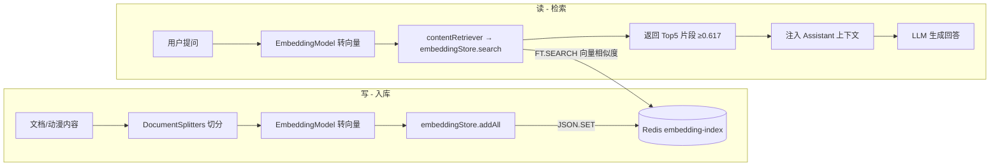

# RAG 调用向量数据库链路

RAG（检索增强生成）对 Redis 向量数据库的调用分两个阶段：**入库（写）** 与 **检索（读/查询）**。

## 一、入库阶段（写向量）— RagIndexUtil

方向：文档 → 切分 → 嵌入 → 写 Redis 向量库。

```java
// RagIndexUtil.java:55 indexDocument()
DocumentSplitter splitter = DocumentSplitters.recursive(500, 100);   // ① 切成 500 字符片段（重叠100）
List<TextSegment> segments = splitter.split(document);                //    得到若干 TextSegment
List<Embedding> embeddings = embeddingModel.embedAll(segments).content(); // ② bge 模型转向量
List<String> ids = ... idPrefix + ":" + i;                            // ③ 确定性 id（如 anime:1:0）
embeddingStore.addAll(ids, embeddings, segments);                     // ④ 写向量库（关键）
```

- 第④步 `embeddingStore.addAll(...)` 即调用向量数据库。`embeddingStore` 是 `RedisEmbeddingStore`
  （`RagConfig.java:92`），底层用 Jedis 发 **`JSON.SET`** 命令，写入 `embedding-index`，
  key 形如 `embedding:anime:1:0`。
- 触发时机：
  - 启动时 `easyRagIngestor` 灌入 `rag-docs` 目录文档（`RagConfig.java:140`）；
  - 动漫新增/编辑时 `AnimeRagIndexer` 调用（`clearFirst=true` 先清旧再写）。

## 二、检索阶段（查向量）— contentRetriever

方向：用户问题 → 转向量 → 向量库搜相似 → 取 Top5 → 拼进上下文。

```java
// RagConfig.java:101 contentRetriever()
ContentRetriever contentRetriever = EmbeddingStoreContentRetriever.builder()
        .embeddingStore(embeddingStore)   // Redis 向量库
        .embeddingModel(embeddingModel)   // bge 嵌入模型
        .maxResults(5)                    // 最多返回 5 段
        .minScore(0.617)                  // 相似度阈值
        .build();
```

- 用户提问时 langchain4j 用 `embeddingModel` 把问题本身转向量；
- 调 `embeddingStore.search(queryEmbedding, maxResults, minScore)`（关键）；
- `RedisEmbeddingStore` 底层发 **`FT.SEARCH`（RediSearch）** 做向量相似度检索；
- 返回 Top5 片段（得分 ≥ 0.617），注入 `Assistant` 上下文后再交 LLM 生成回答。
- 检索在 `EmbeddingStoreContentRetriever` 内部发生，业务代码不可见——它由
  langchain4j-spring-boot4-starter 自动注入 `@AiService` 的 `Assistant`（与 `ChatMemoryProvider` 同机制）。

## 三、完整链路图



## 四、关键点总结

| 阶段 | 调向量库的代码 | Redis 底层命令 |
|------|--------------|---------------|
| 写（入库） | `RagIndexUtil.indexDocument` → `embeddingStore.addAll`（`RagIndexUtil.java:72`） | `JSON.SET` |
| 读（检索） | `contentRetriever` → `embeddingStore.search`（langchain4j 触发） | `FT.SEARCH` |

- 写与读共用同一个 `EmbeddingModel`（bge-small-en-v1.5），保证文档向量与问题向量在同一语义空间，才能算相似度。
